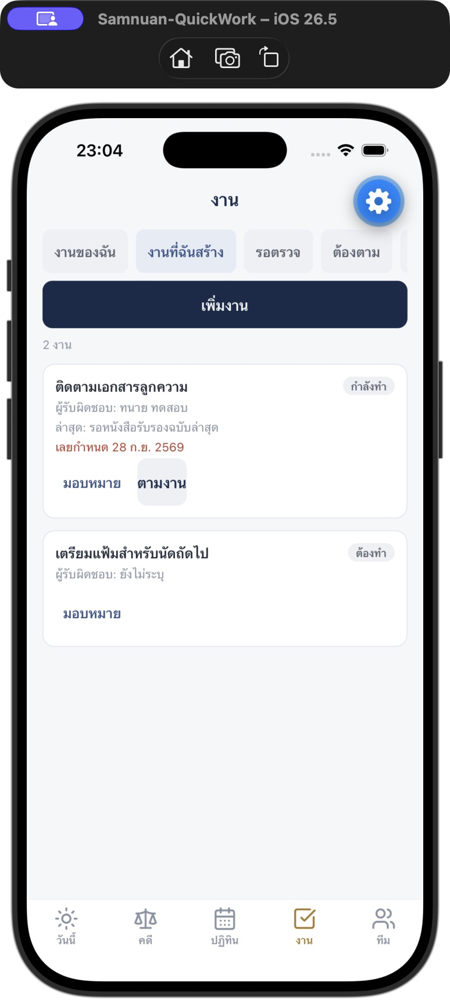
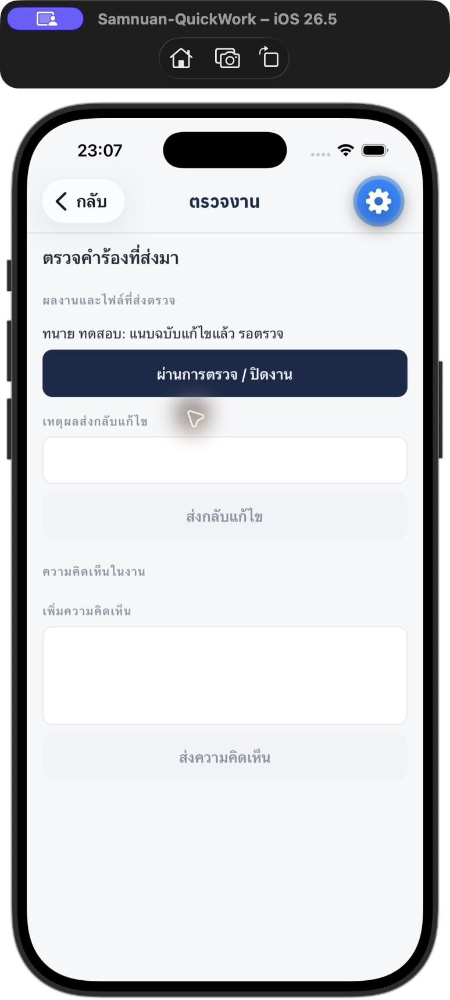
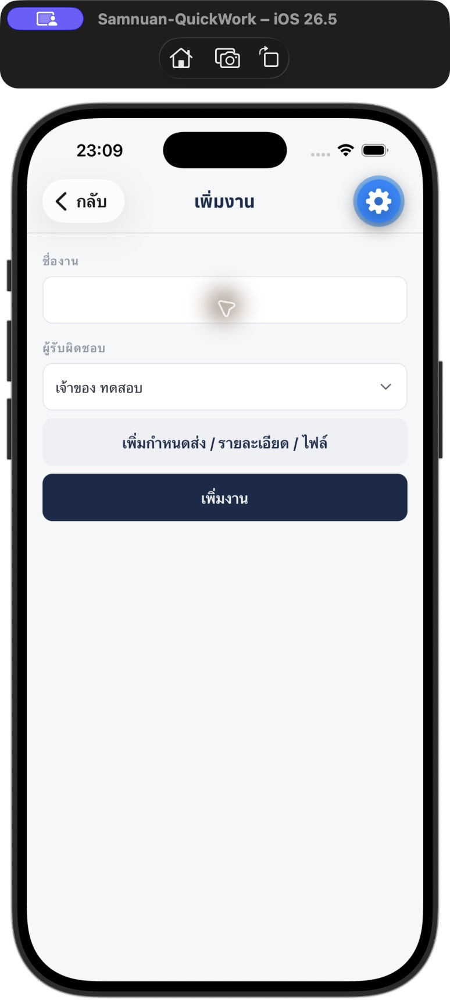

# Mobile quick work — รอบแรก

ทำชุดสั่งงาน/ตามงานและทางเข้างานที่ต้องจัดการ ตามรอบแรกของแผนวันที่ 30 กันยายน 2026 บน branch `codex/mobile-quick-work`

## สิ่งที่เปลี่ยน

- หน้างานมี **งานของฉัน / งานที่ฉันสร้าง / รอตรวจ** โดย API กรองตามผู้ใช้ สำนักงาน และสิทธิ์เปิดงาน
- งานที่ฉันสร้างยังหาเจอหลังมอบหมายให้คนอื่น และรองรับงานที่ยังไม่มีผู้รับผิดชอบ
- OWNER มี **ต้องตาม / ยังไม่มีคนรับ** จาก Daily Workboard เดิม พร้อมเหตุผล ข้อความล่าสุด และวันที่ตามล่าสุด
- ปุ่มตามงานให้ยืนยันผู้รับผิดชอบและชื่องานก่อนเรียก endpoint เดิม ไม่ทำงานอัตโนมัติเมื่อเปิดรายการ
- หน้า “วันนี้” มีปุ่มเข้าตัวกรองโดยตรง และแสดงตัวอย่างงานรอตรวจสูงสุด 3 งาน
- รายการงานจากวันนี้ การแจ้งเตือน และงานพักไว้เปิดรายละเอียดงานตรงตัว รวมงานที่ไม่ผูกคดี
- หน้าตรวจงานแสดงข้อความและไฟล์ส่งงานก่อนปุ่มผ่าน/ส่งกลับ ไม่แสดงฟอร์มแก้ไขที่ไม่จำเป็น
- ผู้ตรวจที่ระบุไว้มีสิทธิ์ตรวจตาม API; OWNER ไม่เห็นปุ่มผ่านงานที่ระบุให้คนอื่นตรวจ
- งานรอตรวจไม่มี checkbox ปิดงาน และงานที่ต้องตรวจไม่สามารถติ๊กเสร็จข้ามขั้นตอนในรายการ
- เพิ่มงานเริ่มจากชื่องานและผู้รับผิดชอบ กำหนดส่ง รายละเอียด และไฟล์เปิดเพิ่มได้
- เปลี่ยนสถานะ ส่งตรวจ ติดตาม มอบหมาย หรือเพิ่มความคิดเห็นแล้วรีเฟรชรายการและตัวเลขที่เกี่ยวข้อง
- เหตุผลที่ต้องตามใช้ฟังก์ชันร่วมกับเว็บ จึงนับวันตาม Asia/Bangkok เหมือนกัน

## API ที่ใช้

`GET /todos?view=mine|created|review` เพิ่มมุมมองที่กรองบน server; ค่าเริ่มต้นและ `view=all` คงพฤติกรรมสำหรับเว็บเดิม ค่าที่ไม่รองรับตอบ 400

รายการใหม่ใช้สิทธิ์เดียวกับการเปิดงาน ร่วมกับขอบเขตสำนักงานก่อนกรองผู้สร้าง ผู้รับผิดชอบ หรือผู้ตรวจ และยังแสดงเฉพาะงานหลัก

OWNER ใช้ `GET /operations/daily?date=YYYY-MM-DD` และ `POST /operations/tasks/:id/follow-up` เดิม ขั้นตอนผ่าน/ส่งกลับใช้ endpoint เดิมของงานคดีหรือ `/todos/:id/accept|reject`

## การตรวจ

- Mobile, API และ web TypeScript ผ่าน
- API: `tasks.service.detail.spec.ts`, `tasks.service.spec.ts`, `daily-operations.service.spec.ts` ผ่าน 61 tests รวมขอบเขตสำนักงาน ตัวกรองผู้สร้าง และผู้ตรวจที่ระบุชื่อ
- Web: `daily-workboard.test.ts` ผ่าน 4 tests หลังย้ายเหตุผลติดตามเป็นฟังก์ชันร่วม
- `node apps/mobile/scripts/check-court-workflow.cjs` ผ่าน รวมทางเข้างานตรงตัว สิทธิ์ผู้ตรวจ และการห้ามติ๊กเสร็จข้ามการตรวจ
- Expo export iOS/Android ผ่าน โดยเป็น JavaScript bundle ไม่ใช่ไฟล์ติดตั้งหรือ release
- Native UI ใน Expo Go SDK 56 บน Simulator iPhone 17 Pro: กดจากวันนี้ไปงานที่ฉันสร้าง พบงานที่มอบหมายให้ทนายและงานยังไม่มีคนรับ; เปิดรอตรวจถึงงานตรงตัวและเห็นผลงาน/ปุ่มตรวจ; ยืนยันผ่านแล้ว mock API ไม่มีรายการนั้นในรอตรวจ
- Native UI: สร้าง `UI quick task` ด้วยชื่องานและเลือกทนาย โดยไม่เปิดช่องเพิ่มเติม แล้วอ่านจาก API จำลองพบ `assigneeId` ของทนาย, `dueDate: null`, `status: TODO`
- Native UI: ส่งกลับพร้อมเหตุผลแล้วอ่าน API จำลองพบ `NEEDS_REVISION` และผู้รับผิดชอบกลับเป็นทนาย คิวรอตรวจเหลือ 0

หลักฐาน native UI ใช้ API จำลองในเครื่อง ข้อมูลสมมติ ไม่มีการทดสอบการเขียนลงฐานข้อมูลจริง การส่งแจ้งเตือนถึงคนจริง หรือ production รอบนี้

## ภาพหน้าจอจริงจาก Simulator

ข้อมูลในภาพเป็นข้อมูลทดสอบ มีปุ่มเครื่องมือ Expo Go ซึ่งไม่ใช่ UI ของ release

## ขอบเขตการนำขึ้นใช้

การรวม source เข้า main ไม่ได้ปล่อย API หรือแอปให้ผู้ใช้ รอบนี้ยังไม่ได้ push, deploy หรือออก APK/TestFlight ต้องปล่อย API ที่รองรับ `view` พร้อมกับแอปรุ่นนี้ก่อนตรวจข้อมูลจริง

ชุดเอกสารหน้างาน ส่งต่อหลังขึ้นศาล และรับเรื่องแบบสั้นเป็นรอบถัดไป ยังไม่ได้เปลี่ยนในรอบนี้
