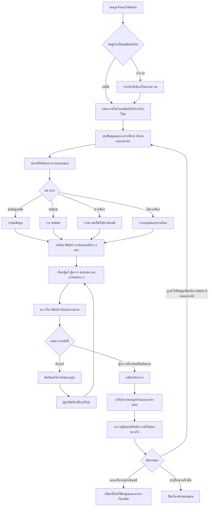

# LexFlow — โต๊ะทำเรื่องก่อนฟ้อง

วันที่: 8 กันยายน 2026 · ต้นแบบเพื่อเลือกแนวทาง ไม่ใช่ระบบเชื่อมต่อจริง

## เป้าหมาย

จากอีเมลลูกค้าหนึ่งเรื่อง ให้สำนักงานทำต่อได้จากหน้าเดียว ลดการกรอกซ้ำ จัดไฟล์ ส่งไฟล์ซ้ำ และถามหาสถานะ โดยทนายยังใช้ Word, OneDrive และกระดาษตรวจตามเดิม

สิ่งที่ผู้ใช้ยืนยัน: รับเมลและเอกสาร → ประเมินว่าควรฟ้องหรือไม่ → อาจส่ง notice → ตอบลูกค้าพร้อมเหตุผล → เก็บ Word ใน OneDrive → ส่งให้ผู้ตรวจ ก่อนดำเนินการต่อ ผู้ตรวจและคนแก้เลือกได้ตามงาน ไม่ล็อกตามตำแหน่ง

## เปิดต้นแบบ

จากโฟลเดอร์โปรเจกต์:

```sh
python3 -m http.server 3012 --bind 127.0.0.1 --directory docs/prototypes/prelitigation-workspace
```

เปิด http://127.0.0.1:3012

- `?variant=1` — A: โต๊ะทำเรื่อง เป็นหน้าทำงานหลัก มีขั้นตอนและบริบทเรื่องด้านข้าง
- `?variant=2` — B: คิวเอกสารรอตรวจ ให้ผู้ตรวจเปิดงาน ส่งกลับ หรือยืนยันรุ่น
- `?variant=3` — C: แผนภาพขั้นตอน กดเข้าแต่ละหน้าทำงานได้
- เปลี่ยนจากแถบล่าง หรือปุ่มลูกศรซ้าย/ขวานอกช่องกรอก
- ทั้งสามมุมมองใช้ข้อมูลจำลองเดียวกัน สถานะเก็บในหน่วยความจำ รีโหลดหรือเริ่มใหม่แล้วล้าง ไม่แตะข้อมูลแอปจริง

นี่เป็นต้นแบบแยกจากหน้า production เพื่อทดลอง flow ข้ามเมนูรับเรื่อง/เอกสาร/งาน พร้อมใช้โครง navigation ของ LexFlow เป็นบริบท เมื่อเลือกแบบแล้วจึงออกแบบ implementation ในระบบจริง

## Flow หลัก



## หน้าจอและสิ่งที่ลดให้

| หน้าจอ | งานที่ระบบเตรียม | สิ่งที่คนยืนยัน |
|---|---|---|
| รับเรื่อง | รวมเมล/ไฟล์ ตั้งชื่อแฟ้ม เสนอจับคู่ลูกค้า | เรื่องใหม่หรือเดิมเมื่อกำกวม |
| ประเมิน | ข้อเท็จจริง สิ่งที่ขาด จุดอ้างอิง | แนวทางและเหตุผล ไม่ใช้ AI ตัดสินเอง |
| เตรียม Word | ข้อมูลเรื่อง ชื่อไฟล์ ต้นแบบ ตำแหน่ง OneDrive | ข้อเท็จจริงเฉพาะเรื่องและต้นแบบที่ใช้ |
| ตรวจ/แก้ | รุ่นไฟล์ คิวผู้ตรวจ ผู้แก้ ประวัติ | ผู้ตรวจรอบนี้ ขอบเขต และผลตรวจ |
| ตอบลูกค้า | ร่างจากเหตุผลที่ยืนยันและรุ่นเอกสารผ่านตรวจ | ผู้รับ เอกสาร และการส่งจริง |

ลดการเปลี่ยนสถานะเอง: สั่งส่งตรวจหนึ่งครั้งสร้างรอบตรวจและอัปเดตคิว; บันทึกรุ่นใหม่ทำให้รู้ว่ารอตรวจใหม่; ยืนยันครบจึงเป็นฉบับผ่านตรวจ ไม่ต้องแก้สถานะงานอีกหน้า

## คนกับสิทธิ์

- ผู้รับผิดชอบเรื่องหนึ่งคนหรือทีมรับผิดชอบตามการออกแบบจริง
- ผู้ร่าง/ผู้แก้หลายคนได้ เลือกหรือเปลี่ยนตามเอกสาร
- ผู้ตรวจเลือกได้ตามงาน ไม่ผูกกับ Owner/Senior/Lawyer; ต้นแบบให้คนต่างตำแหน่งเป็นทั้งผู้แก้และผู้ตรวจ
- การเลือกคนใช้เฉพาะสมาชิกที่เข้าถึงเรื่องนั้นอยู่แล้ว การเชิญหรือเพิ่มสิทธิ์เป็น flow แยก
- คนแก้กับคนอนุมัติซ้ำกันได้เฉพาะเมื่อกติกาสำนักงานยอมรับ ไม่ควร hardcode ว่าต้องห้ามหรืออนุญาตทุกสำนักงาน
- ต้นแบบใช้กติกา **ผู้ตรวจทุกคนที่เลือกต้องยืนยัน** เพื่อแสดงผลที่ชัด ยังไม่ได้ตัดสินว่าทุกสำนักงานต้องใช้กติกานี้ ระบบจริงอาจต้องเลือกตามลำดับ/คนใดคนหนึ่ง/ครบทุกคน
- ผู้มีอำนาจอนุมัติการส่งออกเป็นนโยบายแยกจากการเข้าถึงและการแก้ไฟล์

## แยกสถานะ เพื่อไม่ให้ระบบอ้างว่างานเสร็จเกินจริง

1. เรื่อง: รับเข้า / รอประเมิน / รอข้อมูล / รอผล notice / รับเป็นคดี / ปิดเรื่อง
2. เอกสาร: ร่าง / รอตรวจ / ต้องแก้ / ผ่านตรวจ ผูกกับ version
3. รอบตรวจ: ผู้ตรวจ ขอบเขต กำหนดตรวจ ผลรายคน และเหตุผลส่งกลับ
4. การสื่อสาร: ร่าง / ตรวจแล้ว / สร้างร่างใน Outlook / ยืนยันส่งจริง / ส่งไม่สำเร็จ
5. เอกสารที่ลูกค้าเข้าถึง: แยกจากเอกสารทำงานภายใน ไม่เผยแพร่ทุกฉบับ

กติกาสำคัญ: แก้เนื้อหาหรือแนวทางหลังผ่านตรวจ → รุ่นใหม่ต้องตรวจใหม่; ส่งเมลร่างไม่เท่ากับส่งจริง; ผ่านตรวจไม่เท่ากับยื่นฟ้อง; รับเอกสารไม่เท่ากับรับเป็นลูกความเพื่อดำเนินคดี

## การใช้ Word / OneDrive

ในต้นแบบเป็นภาพและสถานะจำลอง ยังไม่มีการเชื่อม Microsoft 365 และไม่สร้าง .docx

ก่อน implementation ต้องตรวจ mailbox ส่วนตัว/ส่วนกลาง การแบ่งพื้นที่ OneDrive/SharePoint การเข้าถึงของทีม การตรวจรุ่นร่วมกัน และสิทธิ์ที่ได้รับจริง ไม่รับรองว่าการเชื่อมพร้อมใช้งานจากเพียงหน้าจอนี้

แนวทาง: ลิงก์ไฟล์ต้นฉบับเดียวต่อเอกสาร เก็บ reference และ version ที่ส่งตรวจ เลี่ยงการส่งสำเนาหลายชุด ผูกผลอนุมัติกับ revision ที่แน่นอน หากตรวจพบไฟล์เปลี่ยนพร้อมกันให้ทบทวนก่อนยืนยัน

## กระดาษและต้นแบบศาล

- ผู้ตรวจพิมพ์และคืนกระดาษตามเดิม ผู้แก้รับข้อแก้ไขในเรื่องนั้น
- สแกนเป็นทางเลือก ไม่สร้างขั้นตอนบังคับเพิ่ม
- รหัสรุ่นบนชุดตรวจภายในต้องแยกจากฉบับยื่นจริง โดยเฉพาะแบบศาล
- แบบศาลที่ยังไม่ตั้งค่าหรือยังไม่ตรวจรูปแบบ ไม่เปิดปุ่มเติมอัตโนมัติ
- การนำแบบใหม่เข้าระบบต้องเก็บรุ่น แหล่งที่มา ผู้ตรวจและวันตรวจ ไม่แทนต้นแบบเดิมของเอกสารเก่า

## Edge cases สำหรับพัฒนาต่อ

- เมลซ้ำ ไฟล์ซ้ำ หลายเรื่องในเมลเดียว และลูกค้าคนเดียวมีหลายเรื่อง
- ข้อมูลจากสองไฟล์ไม่ตรงกัน / ข้อมูลขาด / อ่านเอกสารไม่ได้ ต้องชี้แหล่งและให้ยืนยัน
- เปลี่ยนผู้ตรวจกลางรอบ หรือผู้ตรวจลาออก ให้เก็บประวัติและยืนยันเงื่อนไขรอบใหม่
- หลายคนแก้พร้อมกัน หรือแก้หลังมีคนอนุมัติไปแล้ว
- OneDrive ย้ายไฟล์ ลิงก์ขาด สิทธิ์ถูกถอน และเมลเชื่อมต่อหมดอายุ
- เปลี่ยนแนวทางจาก notice เป็นฟ้อง หรือจากฟ้องเป็นไม่ฟ้อง ต้องทบทวนร่าง/ข้อสรุปเดิม
- ส่งจริงล้มเหลว ห้ามแสดงเป็นส่งแล้ว และห้าม retry จนส่งซ้ำโดยไม่ตรวจสถานะ
- การติดตาม notice/กำหนดเวลาต้องมาจากข้อมูลที่ทนายยืนยัน ไม่สร้างกำหนดทางกฎหมายเอง

## ขอบเขตกดเล่นได้

- ดูเมลและต้นทางจำลอง → เลือกแนวทางและกรอกเหตุผล
- แสดงร่างจากข้อมูลที่ยืนยัน เลือกแหล่งต้นแบบ
- เลือกผู้ตรวจ/ผู้แก้หลายคน พร้อมตรวจค่าจำเป็น
- สลับคิวผู้ตรวจ ส่งกลับพร้อมเหตุผล จำลองรับกระดาษคืน
- แก้เป็นรุ่นใหม่ ส่งรอบใหม่ ยืนยันทีละคนจนผ่านครบ
- บล็อกร่าง Outlook จนผ่านตรวจและตรวจผู้รับ/เหตุผล
- แสดงผลจำลองว่าสร้างร่างแล้ว ยังไม่ส่ง

ขั้นเปิดคดี ส่งจริง ปิดเรื่อง การอัปโหลด สแกน OCR เปรียบเทียบ Word และ Microsoft 365 อยู่ใน flow/ข้อกำหนดเท่านั้น ยังไม่ implement ในต้นแบบ

## เกณฑ์เลือกแนวทาง

ให้ทนายลองจากเมลหนึ่งเรื่องจนส่งตรวจ แล้วผู้ตรวจคืนข้อแก้ ก่อนส่งรุ่นใหม่ วัดจำนวนครั้งกรอกซ้ำ จำนวนครั้งหาไฟล์/สลับแอป และเวลาจัดการรอบตรวจ เทียบกับวิธีเดิม ไม่สมมติเปอร์เซ็นต์เวลาที่ลดได้

แนะนำ A เป็นหน้าใช้งานประจำ, B เป็นหน้าเริ่มต้นสำหรับคนตรวจหลายเรื่อง, C ใช้อธิบาย flow และ onboarding ยังไม่มี variant ที่ผู้ใช้เลือกยืนยัน และยังไม่เปลี่ยนหน้า production

## ปรับหน้าตรวจตามข้อเสนอผู้ใช้

เมื่อกด “เปิดตรวจ” จากคิว ให้เปิดเอกสารในบริบทผู้ตรวจคนที่เลือก พร้อมแถบ “ผ่านการตรวจ / ส่งกลับแก้ไข” ในหน้าเอกสาร ไม่ต้องย้อนกลับไปกดที่ตาราง จำชื่อผู้ตรวจจากคิวไว้ และมีปุ่มกลับคิวตรวจ

ผลหลังยืนยัน: แสดง “คุณตรวจผ่านแล้ว” หากยังรอคนอื่น หรือ “ผ่านการตรวจครบทุกคนแล้ว” เมื่อครบ ห้ามยืนยันซ้ำ และเก็บการยืนยันกับรุ่นเอกสาร
