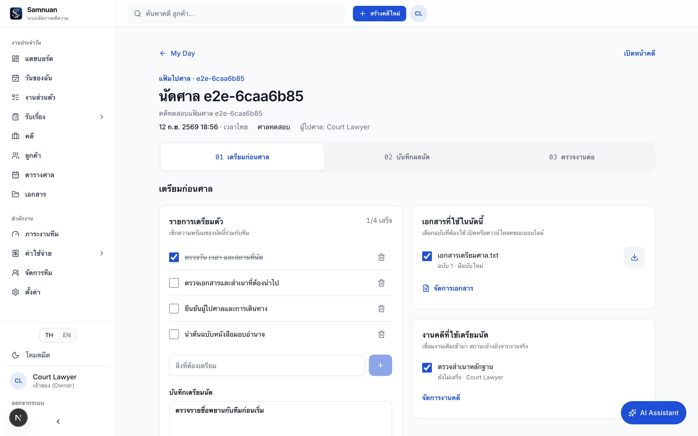
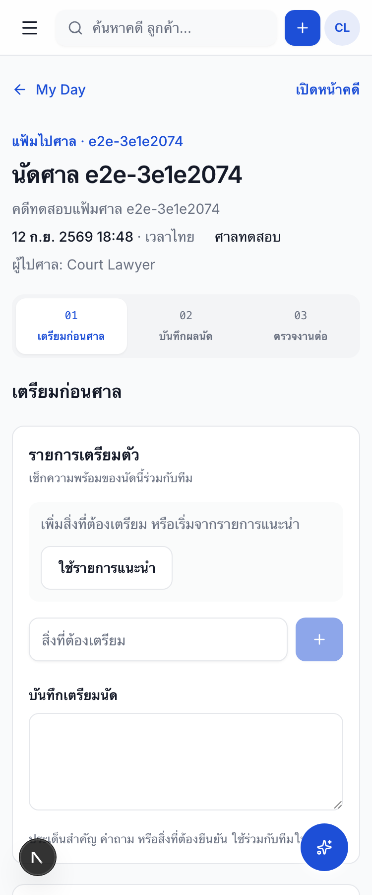
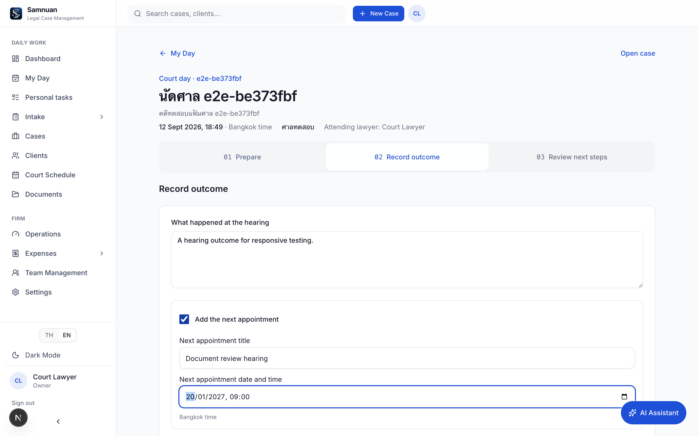

# Samnuan — แฟ้มไปศาล: เตรียม บันทึกผล และจัดงานต่อ

วันที่: 12 กันยายน 2026
สถานะ: พัฒนาและทดสอบบน local; ชุดแรกของแผนพัฒนาผลิตภัณฑ์

## วิธีใช้งาน

1. เปิด **My Day / วันของฉัน** แล้วเลือก **เปิดแฟ้มไปศาล** ในนัดศาล หรือเปิดหน้าคดี → **บันทึกผลหลังขึ้นศาล** → เลือกนัด
2. **เตรียมก่อนศาล:** เพิ่ม checklist หรือใช้รายการแนะนำ เชื่อมงานเดิม เลือกเอกสารฉบับที่ใช้ และจดประเด็นเตรียมนัด กดบันทึกเพื่อให้ทีมเห็น
3. **บันทึกผลนัด:** กรอกผลที่เกิดขึ้นจริง เปิดเฉพาะตัวเลือกที่ต้องใช้ เช่นนัดครั้งหน้า งานติดตาม ค่าใช้จ่าย และร่างแจ้งลูกความ
4. **ตรวจงานต่อ:** ตรวจรายการทั้งหมดก่อนยืนยัน เมื่อบันทึกแล้วกดเปิดนัด งาน ค่าใช้จ่าย หรือร่างแจ้งลูกความต่อได้เลย

## สิ่งที่ทำให้ใช้ง่ายขึ้น

- เลือกนัดครั้งเดียว ใช้คดี ศาล เวลา และผู้ไปศาลจากข้อมูลเดิม
- รองรับภาษาไทย/อังกฤษ ใช้เวลา Asia/Bangkok แม้อุปกรณ์อยู่เขตเวลาอื่น
- ช่องกรอกเพิ่มเติมปรากฏเมื่อเลือกใช้เท่านั้น มีหน้าตรวจรายการก่อนบันทึกจริง
- เชื่อมงานเดิมโดยไม่สร้างสำเนางาน; สถานะงานมาจากข้อมูลของงานจริงเมื่อโหลดหน้า
- เอกสารระบุฉบับที่เลือก หากมีฉบับใหม่จะแจ้งให้เห็น แต่ดาวน์โหลดฉบับที่เตรียมไว้ตามเดิม การเปลี่ยนฉบับทำได้โดยยกเลิกเลือกแล้วเลือกใหม่
- แยกสถานะข้อมูลที่ยังไม่บันทึกกับข้อมูลที่ส่งให้ทีมแล้ว
- กู้คืนร่างที่ยังไม่ส่งจาก sessionStorage ในแท็บเดิม ผูกกับสำนักงาน ผู้ใช้ และนัด อายุไม่เกิน 24 ชั่วโมง ล้างเมื่อบันทึกสำเร็จหรือกดออกจากระบบ
- เมื่ออีกหน้าจอแก้ข้อมูล จะไม่เขียนทับเงียบ ๆ มีทางคัดลอกข้อความของตนและโหลดข้อมูลล่าสุด
- เมื่อเปิดร่างแจ้งลูกความ ใช้ draftId เพื่อเปิดร่างที่มาจากนัดนี้โดยเฉพาะ
- ปุ่มหลักสูงอย่างน้อย 44px และแถบยืนยันอยู่ท้ายฟอร์ม เพื่อไม่ลอยบังช่องกรอก

## การบันทึกและสิทธิ์

เพิ่ม `CourtDay` หนึ่งรายการต่อ `CalendarEvent` เก็บ state และ version ของการเตรียมนัด พร้อมผลลัพธ์หลังบันทึก การอ่านและเขียนผ่านขอบเขตสิทธิ์คดีเดิมทั้งสำนักงานและสมาชิกที่ได้รับมอบหมาย

การยืนยันผลใช้ธุรกรรมฐานข้อมูลเดียวสร้างความเคลื่อนไหวคดี นัดถัดไปและข้อเสนอกำหนดเวลา งานติดตามพร้อมผู้รับผิดชอบ ร่างค่าใช้จ่าย และร่างรายงาน ตามตัวเลือกของผู้ใช้ ส่วนใดล้มเหลวย้อนทั้งชุด การส่งคำขอซ้ำหลังสำเร็จจะคืนผลเดิม ไม่สร้างข้อมูลซ้ำ

- ตรวจ version ของแฟ้มและเวลาปรับปรุงของนัดก่อนบันทึก; กั้นนัดที่ยังไม่เริ่ม
- มี audit event `COURT_DAY_RECORDED` อ้างถึงรายการที่สร้าง
- งานติดตามให้ผู้บันทึกเป็นผู้รับผิดชอบก่อน ส่งต่อผ่านระบบงานเดิมได้
- ค่าใช้จ่ายเป็น `DRAFT`; การบันทึกไม่ได้ส่งเบิกหรือจ่ายเงิน
- ร่างลูกความสร้างจากข้อมูลที่ทนายกรอกและอ้างกิจกรรมต้นทาง ไม่เรียก AI ไม่อนุมัติหรือส่งข้อความให้เอง
- นัดใหม่เข้าสู่ระบบปฏิทินและการเตือนตามกำหนดเดิม แต่คำสั่งบันทึกผลนัดนี้ไม่ส่งข้อความภายนอกทันที

## หลักฐานทดสอบ

**E2E รวมผ่าน 69/69 เทสต์ — ไม่มี skipped หรือ retries — 6.7 นาที**

| ชุดตรวจ | ผล |
| --- | --- |
| แฟ้มไปศาลใหม่ | 9 ผ่าน |
| สมัคร/เข้าสู่ระบบและ user journeys เดิม | 16 ผ่าน |
| Login setup | 1 ผ่าน |
| หน้าทำงานเดิม/ขนาดจอ/search/retry | 33 ผ่าน |
| Validation เดิม | 10 ผ่าน |
| Web unit tests | 34 ผ่าน |
| Deadline rule service tests | 21 ผ่าน |
| TypeScript — Web/API | ผ่านทั้งคู่ |
| git diff --check | ผ่าน |

รอบรวมช้ากว่าชุดเฉพาะเนื่องจากการนำทางใน local dev หลายหน้า ผลนี้ไม่ใช่การวัดประสิทธิภาพ production

ทวนเพิ่มทางเข้า **หน้าคดี → เลือกนัด → แฟ้มที่บันทึกไว้** ผ่าน พร้อมทดสอบต่อจนถึงร่างแจ้งลูกความอีกครั้ง

[เปิดรายงาน Playwright](../../e2e/report/index.html)

ชุดเฉพาะแฟ้มไปศาลครอบคลุม:

- My Day → checklist/งานเดิม → บันทึกและ reload → ดาวน์โหลดไฟล์จริง → ผลนัด → นัด/งาน/ค่าใช้จ่าย/ร่าง → เปิดตรวจร่างที่ตรงกัน
- เลือกเอกสาร v1 แล้วเพิ่ม v2: ยังคงดาวน์โหลดเนื้อหา v1 ได้
- ทำ response หายหลังเซิร์ฟเวอร์บันทึกสำเร็จ แล้วลองซ้ำ: กิจกรรม นัด งาน และร่างไม่ซ้ำ
- ส่ง complete พร้อมกันสองคำขอ: ได้ผลลัพธ์ชุดเดียว
- ข้อมูลถูกแก้จากอีกหน้าจอ, เครือข่ายล้มเหลวก่อนบันทึก, นัดที่เปลี่ยนระหว่างกรอก
- ปฏิเสธข้ามสำนักงาน และสมาชิกสำนักงานเดียวกันที่ยังไม่ได้รับสิทธิ์คดี; สมาชิกที่ได้รับมอบหมายอ่านแฟ้มร่วมกันได้
- ปฏิเสธงานจากอีกคดี payload ขาด state และการบันทึกผลก่อนเวลานัด
- จำลอง dependency ล้มเหลวใน service จริงกับ PostgreSQL: state/version และรายการที่สร้างทั้งหมด rollback
- กู้คืนร่างหลังเปลี่ยนหน้า และล้างร่างเมื่อออกจากระบบ
- หน้าทั้งสามขั้นตอนที่ 320 / 375 / 414 / 768 / 1440px ทั้ง TH และ EN รวมการเปิดช่องกรอกวันเวลานัด

Fixture สร้างสำนักงาน/คดีชั่วคราวและไฟล์ใน temporary directory ล้างเฉพาะข้อมูลของรอบทดสอบ ไม่ reset ฐานข้อมูลเดิม

## ภาพหน้าจอ

ภาพจากบัญชีและคดีชั่วคราวของชุดทดสอบ







## Migration และการย้อนกลับ

Migration: `20260912193000_court_day_workspace` เพิ่มตารางเดียว ไม่มีการแก้ไขหรือลบข้อมูลเดิม ใช้ cascade เฉพาะแฟ้มเมื่อมีการลบนัดต้นทาง

เครื่อง local มี migration เดิมค้างอยู่ 3 รายการ จึงใช้ SQL ของ migration ใหม่นี้เพียงรายการเดียว และบันทึกว่า applied ไม่รัน migration เดิมเหล่านั้น:

- `20260910140000_company_isolation_global_master`
- `20260910214000_firm_slug_thesiambarristers`
- `20260911090000_drop_claim_amount_case_field`

การย้อนรุ่นแอปทำได้โดยคงตารางใหม่ไว้ โค้ดรุ่นเก่าไม่อ่านตารางนี้ ห้าม drop ตารางเพื่อ rollback โดยไม่สำรองข้อมูลเตรียมนัดและตรวจผลลัพธ์ที่บันทึกแล้ว การ deploy production ต้องตรวจ migration history ของ environment นั้นก่อน รอบนี้ไม่ได้ deploy

## ขอบเขตที่ยังไม่ได้ทำ

- ยังไม่ใช่ระบบ offline เต็มรูปแบบ ต้องออนไลน์เพื่อเปิดหน้า โหลดข้อมูล แชร์ให้ทีม และยืนยันผล ร่างในแท็บไม่ใช่การซิงก์ offline และไม่ได้รับประกันการกู้คืนหลังปิดเบราว์เซอร์
- หนึ่งนัดมีผลยืนยันหนึ่งชุด รายการที่สร้างเปิดจัดการผ่านหน้าคดีเดิม; ยังไม่มี workflow แก้ไขผลนัดฉบับใหม่ในแฟ้มนี้
- ไม่ได้ส่งข้อความหรืออีเมลภายนอก ทดสอบ client draft ที่ยังไม่อนุมัติ
- ทดสอบ Chromium local ยังไม่ใช่การรับรอง Safari/Firefox หรือ production performance
- Roadmap ส่วนอื่น เช่นศูนย์ escalation เต็มรูปแบบ, Portal workroom, playbook และ AI พร้อม citation ไม่ได้รวมในชุดแรกนี้

## รันซ้ำ

```bash
pnpm exec playwright test --project=court-day --project=journeys --project=workspace --project=validation
pnpm --filter web test
pnpm --filter api test -- --runInBand src/deadlines/deadline-rules.service.spec.ts
pnpm --filter web exec tsc --noEmit --incremental false
pnpm --filter api exec tsc --noEmit -p tsconfig.build.json
```

ต้องมี web/API/database local และ Prisma client ที่ generate จาก schema ปัจจุบัน การทดสอบ rollback ใช้ service ที่ compile ไว้ใน `apps/api/dist` ของ local dev
