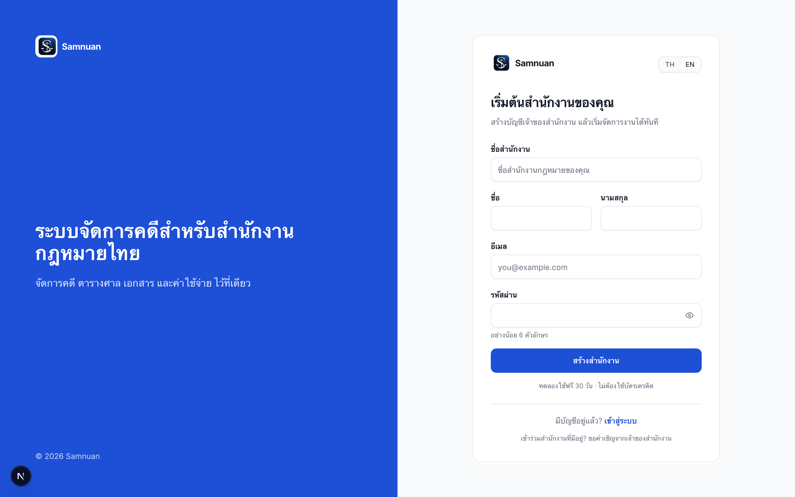
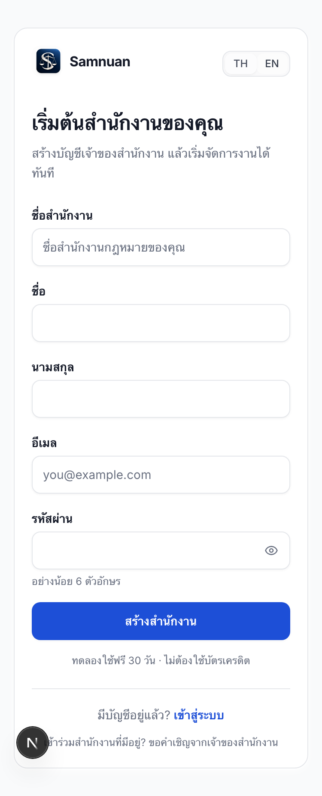
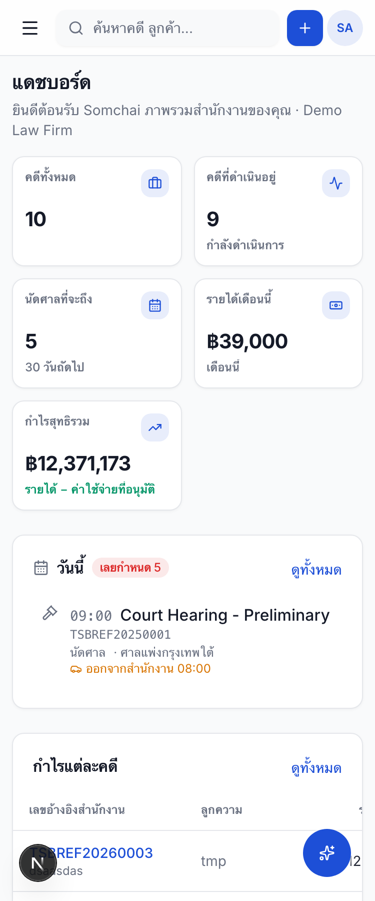

# Samnuan — E2E และการปรับปรุงประสบการณ์ใช้งาน

วันที่ตรวจ: 12 กันยายน 2026  
ระบบ: `http://localhost:3005` และ API `http://localhost:3001`  
ธีม: ใช้สี ฟอนต์ โลโก้ และองค์ประกอบของ Samnuan เดิม

## ผลรอบสุดท้าย

**E2E ผ่าน 60/60 — ไม่มี skipped และไม่มี retries — เวลา 2.9 นาที**

| ชุดตรวจ | ผล |
| --- | --- |
| Journeys — สมัคร/login/คำเชิญ/รหัสผ่าน/ขนาดหน้าจอ | 16 ผ่าน |
| Setup — ล็อกอินเจ้าของสำนักงานและเก็บ origin | 1 ผ่าน |
| Workspace — หน้างาน 29 เส้นทาง + responsive/search/retry | 33 ผ่าน |
| Validation — ฟอร์มและ API | 10 ผ่าน |
| Web unit tests | 33 ผ่าน |
| Password recovery + mocked email transport | 5 ผ่าน |
| TypeScript — Web และ API | ผ่านทั้งคู่ |
| `git diff --check` | ผ่าน |

ตรวจฐานข้อมูลหลังจบ: สำนักงาน fixture และบัญชีทดสอบที่มี prefix ของชุดนี้เหลือ **0 รายการ**

[เปิดรายงาน Playwright พร้อมรายการเทสต์และภาพประกอบ](../../e2e/report/index.html)

## สิ่งที่แก้และหลักฐาน

| ปัญหาที่พบ | ผลหลังแก้ |
| --- | --- |
| ปุ่มทดลองใช้ฟรีพาไป Login และ `/register` ไม่มีแบบฟอร์ม | เชื่อม CTA ทุกตำแหน่งกับหน้าสร้างสำนักงาน สมัครแล้วเข้าพื้นที่ของสำนักงานได้จริง |
| ไม่แยกการเปิดสำนักงานใหม่กับการเข้าทีมเดิม | เจ้าของเปิดสำนักงานผ่านแบบฟอร์ม; สมาชิกเข้าผ่านคำเชิญของสำนักงาน |
| ชื่อที่มีแต่ช่องว่างผ่าน API ได้ (`201`) | ตัดช่องว่างและตรวจความยาวใน API; test เดิมต้องได้ `400` |
| Label หน้า Login ไม่ผูกกับช่องกรอก | เพิ่ม label ที่อ่านได้ด้วย assistive technology, autocomplete, แสดง/ซ่อนรหัสผ่าน และ error announcement |
| ผู้รับคำเชิญเขียนเฉพาะ localStorage แต่ไม่อัปเดต auth state | อัปเดต session ของแอปก่อนเข้าหน้าทำงาน; ตรวจการตอบรับใน browser ใหม่และการล็อกอินซ้ำ |
| การส่งต่อ session อาจอ่าน hash ที่ถูกล้างแล้วเมื่อ effect ทำซ้ำ | ประมวลผล handoff ครั้งเดียว ตรวจตัวตนก่อนเปลี่ยนหน้า และมีทางกลับเมื่อผิดพลาด |
| Handoff ที่ผิดอาจไป refresh เป็น session เก่าที่ค้างอยู่ | ตรวจ incoming token โดยไม่ยืม refresh token ของ session เดิม และตรวจปลายทางให้อยู่ origin เดิม |
| เลือก EN ก่อน Login แล้วกลับเป็น TH เมื่อเข้าซับโดเมน | ส่งต่อ locale และเก็บภาษาที่ผู้ใช้เลือกในสำนักงาน |
| Dashboard ที่ 375px มีเนื้อหาด้านในกว้าง 669px แม้ root ไม่ overflow | กำหนดคอลัมน์และ `min-width` ให้ย่อได้ ตรวจทั้ง root และพื้นที่ทำงานจริง |
| หน้า Team โหลดล้มเหลวแต่ดูเหมือนไม่มีสมาชิก | แสดง error พร้อม Retry; ทดสอบจำลอง server failure แล้วกู้กลับได้ |
| การกู้รหัสผ่านสร้าง token แต่ไม่ได้เชื่อมส่งอีเมล | เพิ่มการส่งผ่าน EmailService เดิม และปฏิเสธอย่างสม่ำเสมอเมื่อ production ไม่มีผู้ให้บริการส่งเมล |
| ชุดทดสอบเดิมใช้โดเมนหลักหลัง login ย้ายไปโดเมนสำนักงาน | เก็บ origin ที่ login ไปถึงแล้วใช้กับเทสต์หลังล็อกอิน |
| ชุดทดสอบอ้างฟอร์ม/ปุ่มรุ่นเก่า | ปรับเส้นทางและตัวเลือกให้ตรงกับฟอร์มปัจจุบัน รวมถึงแบบฟอร์มสร้างคดี 2 ขั้น |
| รัน validation แล้วเขียนทับคู่มือผู้ใช้ | สร้างภาพคู่มือเฉพาะเมื่อเปิดโหมด `e2e:guide` |

## เส้นทางที่ทดสอบการบันทึกจริง

ใช้สำนักงานใหม่และบัญชี `@example.test` ที่สร้างขึ้นสำหรับแต่ละรอบเท่านั้น:

1. หน้าแรก → ทดลองใช้ฟรี → สมัครเจ้าของสำนักงาน → เข้าสู่ซับโดเมนสำนักงาน
2. Reload แล้วยังคงเข้าสู่ระบบและเป็นสำนักงานเดิม
3. สร้างลูกค้า → ตรวจว่าปรากฏในรายการ
4. สร้างคดี Litigation → เลือกผู้รับผิดชอบ → เปิดหน้าคดีที่สร้าง
5. บันทึกค่าใช้จ่าย **ร่าง** → ตรวจรายการที่บันทึก
6. สร้างงานส่วนตัว → Reload → เปิดรายละเอียด → เปลี่ยนสถานะ → เพิ่มงานย่อย → ปิดด้วย Escape
7. เปิดหน้าทีมและแสดงคำเชิญ → ผู้รับคำเชิญสร้างบัญชีใน browser context ใหม่ → เข้าหน้าทำงาน
8. ทนายเข้าหน้าจัดการทีมไม่ได้ และ API จัดการทีมตอบ `403`
9. ลิงก์คำเชิญที่ใช้แล้วถูกปฏิเสธ
10. Logout → เปิดหน้าที่ป้องกันไว้แล้วกลับ Login → Login ซ้ำได้
11. บัญชีเจ้าของสำนักงานใหม่ไม่สามารถอ่านคดีของสำนักงาน seed ได้
12. เปลี่ยนรหัสผ่านของบัญชีทดสอบ → Login ด้วยรหัสใหม่ → รหัสเก่าและ token ที่ใช้ซ้ำถูกปฏิเสธ

คำเชิญและ reset token เป็น fixture ที่ seed ในฐานข้อมูล local เพื่อทดสอบการตอบรับโดยไม่ส่งเมลถึงบุคคลอื่น ส่วนขั้นตอนสมัครและบันทึกงานข้างต้นทำผ่าน UI จริง ไม่ mock response สำเร็จ

ล้างเฉพาะข้อมูลของรอบทดสอบใน `finally` ไม่ reset ฐานข้อมูล ไม่แก้ไขข้อมูล demo เดิม ไม่กดจ่ายเงิน และไม่เรียก AI ที่คิดเครดิต

## การตรวจหน้าและขนาดจอ

**เปิดหน้าโดยตรวจ runtime/server error 29 เส้นทาง:** Dashboard, My Day, Todos, Intake, สร้าง Intake, Cases, สร้าง Case, Clients, สร้าง Client, Court Schedule, Calendar, Documents, Operations, Expenses, สร้าง Expense, Team, Settings, Reports, Email Intake, Portal Submissions, Courts, Case Types, Deadline Rules, Holidays, Reimbursements, Billing, Knowledge, Users และ New User

การเปิดหน้าเป็น smoke test ไม่ได้หมายความว่าทุกปุ่มในทั้ง 29 หน้าผ่าน E2E แล้ว โดยเส้นทางบันทึกที่ตรวจจริงระบุไว้ด้านบน

- Login/Register: TH และ EN ที่ **320, 375, 414, 768, 1440px**
- Dashboard/Cases/Court Schedule/Team/Todos: TH และ EN ที่ **375 และ 1440px**
- ตรวจ horizontal overflow ทั้งเอกสารและ `<main>` ไม่อาศัยการซ่อนส่วนเกินของ root
- ปุ่ม submit ของ auth form สูงอย่างน้อย 44px
- ตรวจการค้นหาคดีจาก header และการ Retry ของหน้า Team
- ตรวจ native validation และ API สำหรับยอดเงิน เลขคดี เบอร์โทร และชั่วโมงทำงาน

## ภาพหน้าจอ

### หน้าสมัคร — Desktop



### หน้าสมัคร — Mobile



### Dashboard — Mobile



ตรวจซ้ำชุด mobile 375px หลังเพิ่มการรอให้เมนูปิดและแอนิเมชันจบแล้ว: ผ่าน ภาพ TH/EN เพิ่มเติมอยู่ในรายงาน Playwright

## ขอบเขตที่ยังไม่ได้ยืนยัน

- **การส่งอีเมลถึง inbox จริง:** ทดสอบการเชื่อมต่อ code กับ transport ด้วย mock; ไม่ได้ส่งอีเมลภายนอกในรอบนี้ ต้องตรวจ sender/domain และ APP_URL ของ production แยกต่างหาก
- ไม่ได้ทำรายการชำระเงิน ส่งใบเบิก ส่ง LINE หรือใช้ AI credits
- ไม่ได้ทดสอบ Client Portal แบบครบ flow, การแนบ/ดาวน์โหลดไฟล์ทุกชนิด หรือการใช้งาน offline
- ทดสอบด้วย Chromium ใน local dev; ยังไม่ได้ยืนยัน Safari, Firefox, touch device จริง หรือ production performance
- ระหว่างรันพบ dev navigation บางครั้งใช้เกิน 25 วินาที จึงให้เวลาการโหลดเพียงพอและรันรอบสุดท้ายแบบ serial; ผลนี้ไม่ใช่หลักฐานว่า production โหลดเร็วแล้ว
- หน้าใช้งานบางส่วนยังมีข้อความไทยเขียนตรงในฟอร์ม เช่นสร้างคดี การตรวจ EN รอบนี้ยืนยัน auth flow และ layout ของหน้าที่ระบุ ไม่ใช่รับรองการแปลครบทุกหน้าของผลิตภัณฑ์

## รันซ้ำ

```bash
pnpm exec playwright test --project=journeys --project=workspace --project=validation
pnpm --filter web test
pnpm --filter api exec jest --config jest.config.js --runInBand password-recovery
pnpm --filter web exec tsc --noEmit --incremental false
pnpm --filter api exec tsc --noEmit -p tsconfig.build.json
pnpm e2e:report
```

ต้องมี web/API และฐานข้อมูล local พร้อมใช้งานอยู่ก่อน Fixture จะปฏิเสธฐานข้อมูลที่ไม่ใช่ localhost
